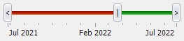
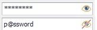
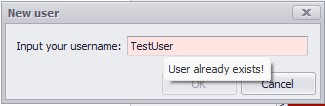
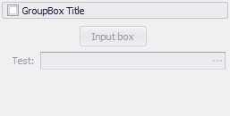
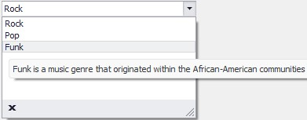
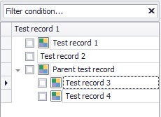
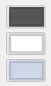

## DevExpress WinForms extension kit
  A small library to solve some troubles, which I met during my work with DevExpress.

### List of components
#### Forms
* XtraFormDev, XtraUserControlDev. The extensions which supports the update mechanism (Begin/EndUpdate to prevent visual/data changes during updating).
#### Editors
* CheckedListBoxControlDev. The extension for the standard component supports hotkeys for fast check/uncheck of items: check/uncheck all, invert check state.
* ColorPickEditDev, RepositoryItemColorPickEdit. The extensions for the standard components allows to save custom user colors during the program, so each ColorPickEdit and RepositoryItemColorPickEdit will have the same, actual user colors.
* DateDoubleTrackbarControlDev. The visual component, which allows users to select range of dates: start, end and date between them. <p align="center">  </p>
* PasswordTextEditDev. The extension for working with passwords, allows user to show/hide input characters. <p align="center">  </p>
* InputBoxValidableDev. InputBox with possibility of using custom function for user input validation. <p align="center">  </p>
* GroupControlCheckedDev. TGroupControl with checkbox in header, allows user to disable/enable all controls in the GroupControl. <p align="center">  </p>
* LookUpDev, RepositoryItemLookUpDev. The extension that allows to show hint for each element in the editor. <p align="center">  </p>
* TreeListDev, TreeListSearchable. The extensions for the standard component which supports:
  1. Hotkes for fast check/uncheck, collapse/expand nodes;
  2. Correct bounds for nodes without stateImage;
  3. Set up correct checkState for TreeList with multiselection option;
  4. Set up correct checkState for children/parent nodes according to their parent/children checkStates;
  5. Optional filtration panel on top. <p align="center">  </p>
* GridView/BandedGridView extensions:
  1. Allows merging a Column and a Band header panel;
  2. Improvement of 'BestFitColumns' to use width of band's title, not only columns;
  3. Improvements to work with merged cells: correct odd/even color, applying user changes to merged cells;
  4. Correct multiple checked changes for 'bool' columns with multiple selected rows;
  5. Cache for FormatRules;
  6. Custom user column header colorizing.
### ProgressManager
  Easy way to attach ProgressBar to XtraUserControl for a long operations with user cancellation. <p align="center">  </p>
#### Extensions
* BaseEditExtension. Contains method 'IsValueEmpty' which allows validating input data of each BaseEdit control for emptiness. If necessary, set up the background color of the control to warning color.
* DateEditExtension. Contains method 'UpdateView' for DateEdit and RepositoryItemDateEdit to initialize the view of the control according to the datetime interval type. 
* TreeListNodeExtension. Contains methods for correct processing of CheckState and Filtering for situations, when checkstate of the parent node depends on children and vice versa.
* ChartControlExtension. Contains method 'ColorizeSameColoredSeries', allowing to change the hue for series with the same color.
* EnumExtension. Useful methods to work with enums:
  1. Allows to get caption/enum-value by DescriptionAttribute;
  2. Fill different DevExpress editors with enum values.
  ``` csharp
      public enum TestEnum
    {
        [Description("Show angles on the map")]
        Angles,

        [Description("Show axis on the graph")]
        Axis
    }
    
    var caption = TestEnum.Angles.GetCaption();
  ```
### Utils
* SkinHelper. Utils to work with colors considering the App Theme, get skin preview image. <p align="center">  </p>
* SolidBrushesCache. LRU cache for solid brushes.
* RegexMaskHelper. Common regex patterns to use as a Mask in editors/repositories.
* XtraUserControlHelper. Allows to show a XtraUserControl in popup window with float/dialog-box modes.
