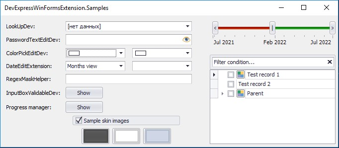
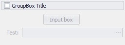
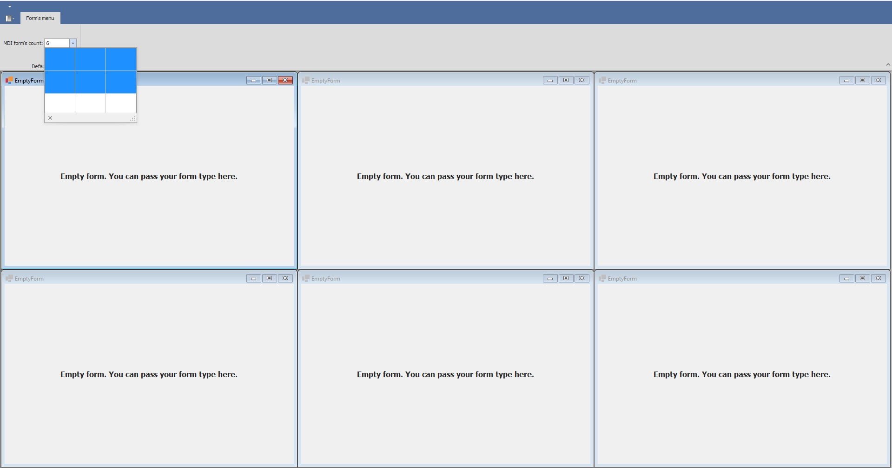
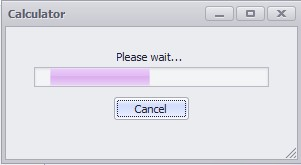

## DevExpress WinForms extension kit
  A small library to solve some troubles, which I met during my work with DevExpress.<p align="center">  </p>
  
### List of components
#### Forms
* XtraFormDev, XtraUserControlDev. The extensions which supports the update mechanism (Begin/EndUpdate to prevent visual/data changes during updating).
#### Editors
* CheckedListBoxControlDev. The extension for the standard component supports hotkeys for fast check/uncheck of items: check/uncheck all, invert check state.
* ColorPickEditDev, RepositoryItemColorPickEdit. The extensions for the standard components allows to save custom user colors during the program, so each ColorPickEdit and RepositoryItemColorPickEdit will have the same, actual user colors.
* DateDoubleTrackbarControlDev. The visual component, which allows users to select range of dates: start, end and date between them. <p align="center">  </p>
* PasswordTextEditDev. The extension for working with passwords, allows user to show/hide input characters. <p align="center">  </p>
* InputBoxValidableDev. InputBox with possibility of using custom function for user input validation. <p align="center">  </p>
* GroupControlCheckedDev. GroupControl with checkbox in header, allows user to disable/enable all controls in the GroupControl. <p align="center">  </p>
* MatrixGridControl and MdiManagerHelper. Use together to provide users the ability to conveniently and quickly arrange MDI forms;
<p align="center">  </p>
* LookUpDev, RepositoryItemLookUpDev. The extensions for the standard component which supports:
  1. Show hints for each element in an editor;
  2. Draw splitter between elements (for example, to realize LRU spiltting). Just add interface to your DataSource item:
  ``` csharp
  internal struct MusicStyleDataItem : ILookUpSplitableItem
  ``` 
  <p align="center">  </p> <p align="center">  </p>
* TreeListDev, TreeListSearchable. The extensions for the standard component which supports:
  1. Hotkes for fast check/uncheck, collapse/expand nodes;
  2. Correct bounds for nodes without stateImage;
  3. Set up correct checkState for TreeList with multiselection option;
  4. Set up correct checkState for children/parent nodes according to their parent/children checkStates;
  5. Optional filtration panel on top. <p align="center">  </p>
* GridView/BandedGridView extensions:
  1. Allows merging a Column and a Band header panel;
  ``` csharp
  new GridPainterDev(bandedGridViewDev);  // Init merger
  GridPainterDev.DisposePainter(bandedGridViewDev);  // Dispose merger
  ```
  2. Improvement of 'BestFitColumns' to use width of band's title, not only columns;
  3. Improvements to work with merged cells: correct odd/even color, applying user changes to merged cells;
  4. Correct multiple checked changes for 'bool' columns with multiple selected rows;
  5. Cache for FormatRules, in case of DataSource changing;
  6. Auto-drawing histogram in a cell - just add keyword to a column Tag add set array of numbers in a grid cell;
  ``` csharp
  colHistogram.Tag = GridHelper.IsHistogramColumn;
  ``` 
  7. Provides fast way to fill a DataTable structure based on the GridView structure;
  8. Custom user column header colorizing. <p align="center">  </p>   <p align="center">  </p> 
  9. Export full GridView table as an image ('GetAsImage'). DevExpress allows to export as an image only visible part of GridView, this method helps to export it all;
  10. Hotkeys for collapsing/expanding groupped rows, copy to clipboard with/without column headers, fast remove/clear selected rows;
  11. Custom group footer height.  <p align="center">  </p> 
### ProgressManager
  Easy way to attach a ProgressBar to any XtraUserControl for long operations with user cancellation. <p align="center">  </p>
  ``` csharp
            var handler = ProgressManager.InitMarquee(this);

            //// Perform long business logic
            new Task(() =>
            {
                while (true)
                {
                    if (handler.Token.IsCancellationRequested)
                    {
                        //// Rollback logic
                        handler.Drop();
                        break;
                    }
                }
            }).Start();
  ```
#### Extensions
* BaseEditExtension. Contains method 'IsValueEmpty' which allows validating input data of each BaseEdit control for emptiness. If necessary, set up the background color of the control to warning color.
* DateEditExtension. Contains method 'UpdateView' for DateEdit and RepositoryItemDateEdit to initialize the view of the control according to the datetime interval type. 
* TreeListNodeExtension. Contains methods for correct processing of CheckState and Filtering for situations, when checkstate of the parent node depends on children and vice versa.
* ChartControlExtension:
  1. Contains method 'ColorizeSameColoredSeries', allowing to auto-change a hue for series with the same color;
  2. Contains lasso processor which provides functionality to select/deselect points in Point Series with lasso tool. Uses hotkeys: ctrl+mouse - to select, shift+mouse - to deselect, double click to clear selection.
  <p align="center">  </p> 
* PropertyGridControlExtension. Contains method 'UpdateFieldsOrderByDisplayOrder' to sort created rows after 'RetrieveFields' based on a System.ComponentModel.DataAnnotations.Order field (was fixed in v22 DevExpress).
  ``` csharp
    /// <summary>
    /// Base row info for a PropertyGridControl demo
    /// </summary>
    public class BaseRowInfo
    {
        /// <summary>
        /// Price
        /// </summary>
        [Category("Level"), Display(Name = "Price", Order = 0)]
        public decimal Price { get; set; }
    }

    /// <summary>
    /// Extended row info for a PropertyGridControl demo
    /// </summary>
    public sealed class ExtendedRowInfo :BaseRowInfo
    {
        /// <summary>
        /// Is level usable
        /// </summary>
        [Category("Level"), Display(Name = "Use level", Order = 3)]
        public bool Use { get; set; }
    }
  ```
* EnumExtension. Useful methods to work with enums:
  1. Allows to get caption/enum-value by DescriptionAttribute;
  2. Fill different DevExpress editors with enum values.
  ``` csharp
    public enum TestEnum
    {
        [Description("Show angles on the map")]
        Angles,

        [Description("Show axis on the graph")]
        Axis
    }
    
    var caption = TestEnum.Angles.GetCaption();
  ```
### Utils
* SkinHelper. Utils to work with colors considering the App Theme, get skin preview image. <p align="center">  </p>
* SolidBrushesCache. LRU cache for solid brushes.
  ``` csharp
	SolidBrushesCache.GetBrushByColor(ForeColor)
  ```
* RegexMaskHelper. Common regex patterns to use as a Mask in editors/repositories.
* XtraUserControlHelper. Allows to show a XtraUserControl in popup window with float/dialog-box modes.
  ``` csharp
	using (var control = new CalcProgressControl())
	{
		XtraUserControlHelper.ShowControl(this, control, "Calculator", isSizable: true);
	}
  ```
* MDITabsDragHelper. Allows to switch between MDI tabs during standard .NET drag'n'drop operation.
  ``` csharp
	_mdiTabsDragHelper = new MDITabsDragHelper(documentManager);
	_mdiTabsDragHelper.SelectNewPageOnDrag = true;
  ```
* NaturalStringComparer. Allows to do natural comparing/sort. DevExpress has it's own NaturalComparer, however it's not work for my case, such strings: 'S_505' and 'S_0505' will equal in DevExpress. But it shouldn't be.
* FormHelper. Give an opportunity to find, get and focus on a specific form with a specific title and tag. It is often used when you need to show a modal window only once.
* ControlScreenshotCapture. Class, which allows to capture screenshot from each sub-control/XtraTabPage/MDI form. On the screenshot a user selected the DateDoubleTrackbarControlDev component on the form and got image of it.
<p align="center">  </p> 
